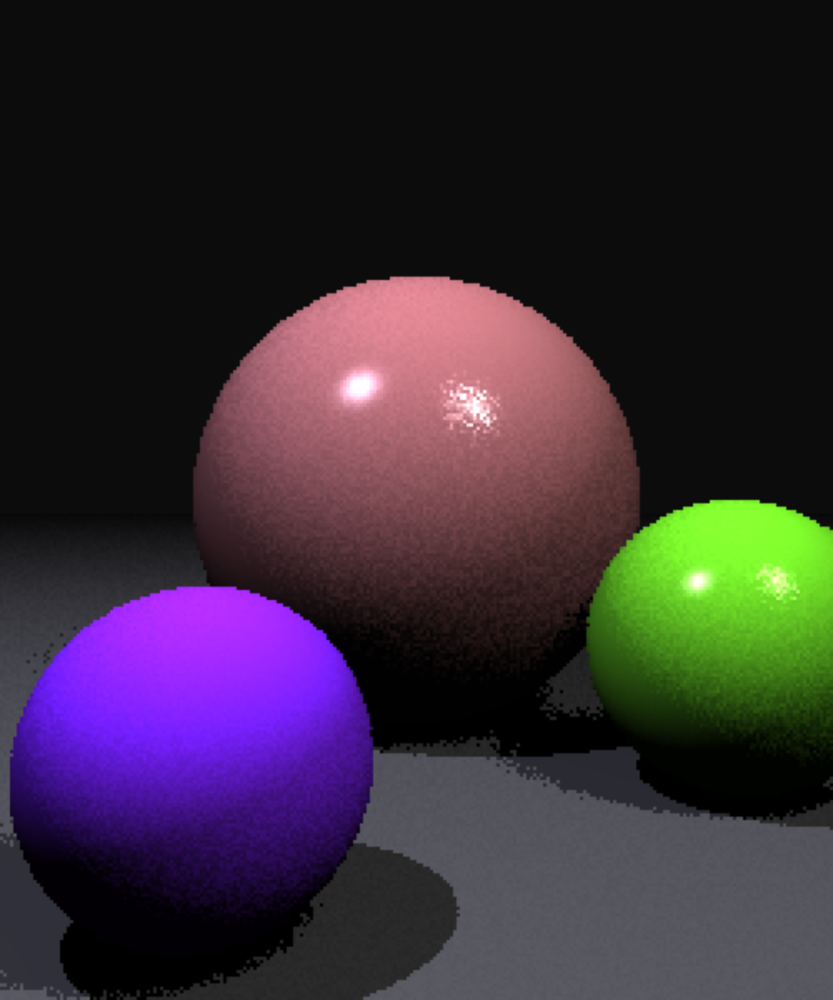

# A3b:  Disks, Area Lights, and Distribution Ray Tracing

In this project you will expand the ray tracer that you wrote for [[Project A3a]](https://github.com/cs3451-f21/a3a-ray-tracing-spheres-jxu443/edit/main/README.md). I added distribution ray tracing, disk objects, area light sources + shadows, reflection, and motion blur. 

Distribution ray tracing enables:
- Soft shadows for area light sources. I casted nultiple rays per pixel, and each shadow ray will be aimed at different places on the area light source. 
- Anti-aliasing of the scene. Casting multiple rays per eye ray (image pixel) anti-alias the scene, reducing noticeable stair-steps at the edges of objects.  

## Rubric

1. Ray/disk intersection
2. Area light source behaves similarly to point light with no distribution 
3. Shadows with hard edges created with no distribution 
4. Distribution of eye rays created correctly for regular grid when no jitter requested
5. Jittered distribution created correctly (randomly distributed within pixels)
6. Area lights appear in highlights correctly with distribution
7. Area lights cast soft shadows correctly with distribution
8. Recursive reflection 
9. Motion blur 

## Project Description

Primary goals:

1. Create disk objects, including a ray/disk intersection routine 
2. Create area light sources
3. Enable shadow creation by light sources
4. Shoot multiple rays per pixel (super-sampling), and use these for anti-aliasing. 
5. Create multiple light rays per surface point being shaded, and use these for soft shadows as well as a specular highlights 

# Scene Description Languages

##### `new_disk  (x, y, z, radius, nx, ny, nz, dr, dg, db, k_ambient, k_specular, specular_power, vx?: number, vy?: number, vz?: number)

Specifies the creation of a disk with its center at `c = (x, y, z)`, with a given `radius`, and with a surface normal `n = (nx, ny, nz)`.  The diffuse color of the sphere is given by `dr, dg, db`.  The coefficient `k_ambient` specifies how much of the ambient light combines with the diffuse color of the surface.  For this project, we will assume that all specular highlights are white, and the brightness of the highlight is given by `k_specular`. The tightness of the highlight is guided by `specular_power`. 

The optional parameters `vx, vy, vz` are only needed for optional motion blur part of the assignment. They represent the velocity of the object. The object is moving from `x,y,z - vx,vy,vz` to `x,y,z + vx,vy,vz` during the time interval being rendered.

##### `area_light (r, g, b, x, y, z, ux, uy, uz, vx, vy, vz)`

Create an area light source at center position `c = (x,y,z)` and its color `(r, g, b)`. Your code should allow at least 10 area light sources.  The vectors `u = (ux, uy, uz)` and `v = (vx, vy, vz)` define a rectangle that gives off light. Specifically, points on the light source can be parameterized by values `s` and `t` in the range of `[-1, 1]`, which define points at positions `p = c + su + tv`. 

When only a single eye ray (no distribution) is used, area lights behave similarly to point lights, shooting a single light ray to their center point.

When more than one ray is used for each pixel (set by the `set_sample_level()` command), you should calculate shadows based on distribution ray tracing.  For each of the rays for a given pixel, you will calculate a distribution of sample positions on the area light source and use them as the light positions for shadow rays. You should calculate these sample positions on the area light by varying s and t in a grid pattern, l. 

For each of these rays you will compute the light contribution in two steps.  For the diffuse contribution, you should compute the contribution per ray, including shadowing, and then average the contribution for all light rays.  For the specular component, if any of the light rays is not shadowed, then you should compute the full specular contribution for that point.

As with point light sources, you do not actually draw the area light sources.  

##### `set_sample_level (level)`  

This method saves the sample level. The `level` is the amount of rays that will be shot per-pixel, for the purposes of anti-aliasing and soft shadows (distribution ray tracing). For level = 1, the default, just a single ray will be shot per-pixel, and all shadows will be hard shadows. For integer values of level greater than one, you will shoot multiple rays per pixel, and these rays will be spaced evenly through different sub-pixels in the pixel in a square grid pattern.  When level = 2, you will shoot 2 x 2 = 4 rays.  For level = 3, shoot 3 x 3 = 9 rays.  In general, you will shoot level x level rays per pixel. The final color of a pixel should be the average of the colors from each of these rays.

When using area light sources (see above) you will be shooting shadow rays towards various parts of the area light sources.  This will give you the effect of soft shadows.

This command is not found in any specific test scene.  Instead, various levels of sampling are set by typing one of the following characters before you render a scene: "qwertyuiop".   Typing "q" sets the sample level to 1.  Typing "w" sets it to 2, and so on up to "p" setting the sample level to 10 (which cause 10x10 = 100 rays to be shot per pixel).

##### `jitter_off()`

This is the default setting for whether to perform jittered sampling.  When jitter is off, you will use a regular grid pattern for creating the position samples on area light sources. Your "soft" shadows will look like overlapping dark regions. Like the `set_sample_level()` command, this command is not used in any particular scene.  Instead, you type the character "n" before rendering a given scene.

##### `jitter_on()`

When jitter is turned on, you will add a slight bit of randomness to the eye rays and the positions of sample on the rectangle for area light sources.  The result will be that your antialiasing and soft shadows will be more smooth than what you get without jitter.  The soft shadows may appear to be noisy for small values used in `set_sample_level()`.  When using higher sample levels, the noise will be reduced.  Type the letter "j" before rendering a scene to call this command.  The regular grid and jittered samples should be selected as described on this slide in the recorded lecture.


##### `reflection_on()`and `reflection_off()`

For each ray that strikes a triangle, if the maximum reflection depth (initially set as 5 on the line `maxDepth = 5;`) has been reached, you should not add any more reflections. Otherwise, you should generate a new reflection ray (by reflecting the current ray around the surface normal) and cast it into the scene. The color contribution of that ray should be adjusted using the `k_specular` surface property and added to the color of the pixel. You should only generate one reflected ray per incoming ray, even if there are distributed rays being computed. 

Pressing the "g" key turns on reflected rays, and "v" turns off reflected rays. Default is off.

##### `blur_on()` and `blur_off()`

Motion blur is implemented on moving objects by observing that a single image captures a scene over a period of time.  During that time, the moving objects in the scene are captured at all locations they are in during that time period, with the results averaged together.  To using distribution ray tracing, we select a different location for each moving object for each ray shot. 

We have provided optional velocity values for the sphere and disk.  This velocity represents a +/- value around the objects location during the frame time, with the object being anywhere from  `x,y,z - vx,vy,vz` to `x,y,z + vx,vy,vz` during the time interval.  For each ray, you should chose one position for the object randomly, and render the scene using that time.  When many rays are shot per eye ray, using a different time for each ray will result in an average pixel color over many possible object locations. 

Pressing the "k" key turns on motion blur, and "m" turns off motion blur. Default is off.

# Results 

NOTE: all of the images here are generated with the parameters `super(div, 500, 600, 250, 300)` in the constructor, except the final high quality renders at the bottom.

Below are the image results when pressing the keys "1234567890-=".

           

(Note: these and other images, are store in full resolution in the project, if you would like to examine them closer.)

Each of these scenes will be slightly improved if you turn on supersampling before rendering them, which performs anti-aliasing, soft shadows, and area light specular highlights.  Because you will shoot and average together multiple slightly different rays per pixel, the silhouettes of objects will blend together more cleanly instead of showing stair-steps, the shadows will be smoother, and the specular highlights will fill in. To get these anti-aliased images, you should type the character "r" before rendering the given scene, which sets the sample level to 4, and type the character "j" to turn on jittering.

           

If we zoom in on the final scene, we can see the antialiasing on the sphere edges, the area shadows (combined with the sharp point shadow) and the highlights from the area and point light.


Here is this final image, with various levels of antialiasing (keys "qweru") and non-jittered distributions:

    

Here is this same final image, with jittered distributions:

    

Especially without only 1 ray, or with a small number of rays, you can see very dramatic differences between the two, with the results getting better as the number of rays increases.

Here is this images for **reflection**, stating with no distribution and continuing with jittered distributions above) (these would be generated with "g=", "jg=", "wjg=", "ejg=", "rjg=" and "ujg="):

      

Finally, here is a high quality "pjg=" run at full resolution 500x600:


Here is this result image for **motion blur**,, captured by typing "pjgk=" run at full resolution 500x600:


# Compile and Run

1. cd into the directory and run ```npm install```
2. run with ```npm run dev```
3. visit ```http://localhost:3000/index.html```

# Recources
base code:  https://github.com/cs3451-f21/assignment-3b-disks-area-lights-and-distribution-chelliy from Gatech CS3451
